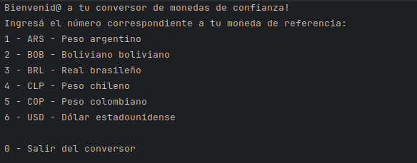
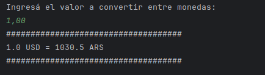

# Desafío: Conversor de monedas

## Descripción
Este desafío fue propuesto en los cursos de Alura Latam y Oracle Next Education (ONE). Es una aplicación capaz de convertir cantidades de dinero en diferentes monedas, así podremos tener una **moneda de referencia** y rápidamente conocer cuánto es su valor equivalente en una **moneda de destino**. Para poder realizar la conversión con valores actualizados de cada moneda, se utilizó la [API de Exchange Rate](https://www.exchangerate-api.com/).

Por ejemplo, en este momento, diciembre de 2024, obtenemos la siguiente conversión:

## Requisitos
La aplicación sólo funciona desde consola, interactuando con una interfaz textual. Allí se podrá realizar la conversión entre monedas eligiendo una moneda de referencia, luego una moneda de destino y finalmente un monto de dinero a convertir (en formato decimal).

Las monedas disponibles para realizar la conversión son:
* 1 - ARS - Peso argentino
* 2 - BOB - Boliviano boliviano
* 3 - BRL - Real brasileño
* 4 - CLP - Peso chileno
* 5 - COP - Peso colombiano
* 6 - USD - Dólar estadounidense

## Caso de uso
Para usar la app, debemos seleccionar la opción numérica de nuestras monedas de interés del menú textual y luego un monto o valor a convertir entre dichas monedas. Al hacerlo, la aplicación nos mostrará la equivalencia entre ambas monedas. Podemos continuar realizando conversiones o *ingresar 0* para salir de la aplicación.

## Tecnologías utilizadas
Para desarrollar la aplicación se emplearon las siguientes tecnologías:
* Java

### Dependencias
* [Gson 2.10.1](https://mvnrepository.com/artifact/com.google.code.gson/gson/2.10.1)
